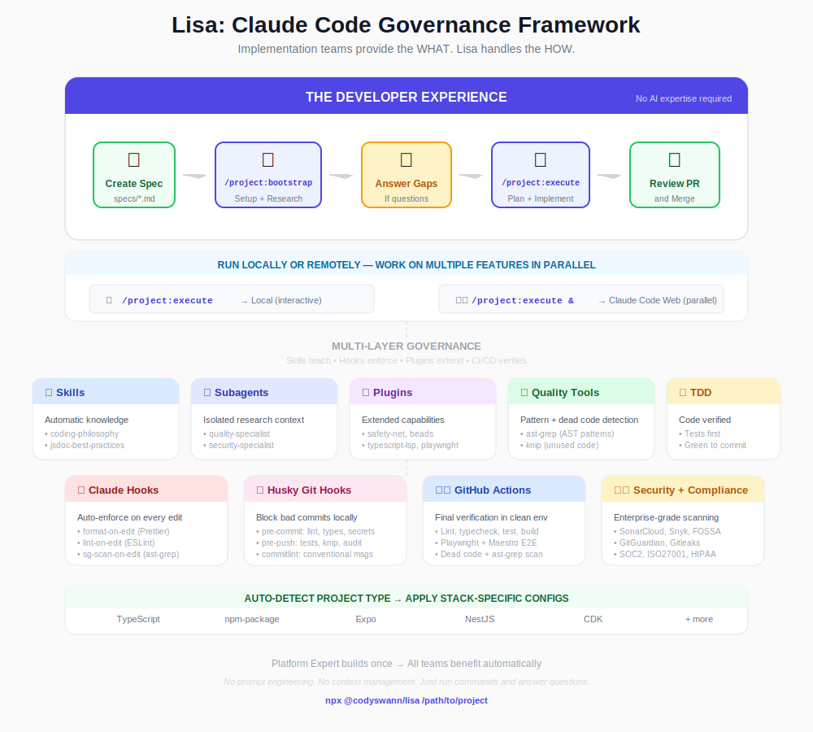

# Lisa: Claude Code Governance Framework



## Executive Summary

**Lisa** is a governance framework that ensures Claude Code produces high-quality, consistent code through multiple layers of guardrails, guidance, and automated enforcement. The system is designed with a key principle: **implementation teams don't need to be AI experts**—they just run commands and let Lisa handle the rest.

### Two Roles, One System

| Role | Responsibility | Skills Needed |
|------|----------------|---------------|
| **Platform Expert** | Sets up skills, hooks, ESLint rules, commands | High - deep AI/LLM expertise |
| **Implementation Teams** | Run commands, answer gap questions, review PRs | None - just use the tools |

The platform expert creates a "paved road" where implementation teams can leverage AI without understanding prompt engineering, context management, or AI limitations. Teams interact with simple slash commands, not raw AI prompts.

---

## Part 1: What is Lisa?

**Lisa** is a multi-layer quality system that prevents AI from producing inconsistent or low-quality code. It works by:

1. **Teaching Claude** the right patterns (Skills)
2. **Enforcing quality automatically** (Hooks, ESLint, Git Hooks)
3. **Guiding workflows** with pre-built commands (Slash Commands)
4. **Blocking bad code** before it's committed (Guardrails)

### The Problem Lisa Solves

Without Lisa, Claude Code can:
- Write inconsistent code styles across sessions
- Skip tests or quality checks when not explicitly told
- Over-engineer solutions or create unnecessary abstractions
- Mutate data instead of using immutable patterns
- Leave deprecated code instead of cleanly deleting it

### The Solution: Layered Governance

| Layer | What It Does | Example |
|-------|--------------|---------|
| **CLAUDE.md** | Direct behavioral rules | "Always use immutable patterns" |
| **Skills** | Teach patterns & philosophy | Why immutability matters, when to use TDD |
| **Hooks** | Auto-enforcement on every edit | Format, lint, ast-grep scan after writes |
| **Plugins** | Extended capabilities | Safety Net, TypeScript LSP, Beads issue tracking |
| **ESLint Plugins** | Enforce code structure | Require statement ordering, prevent inline styles |
| **ast-grep** | Pattern-based linting | Custom AST rules for anti-patterns |
| **Knip** | Dead code detection | Find unused exports, dependencies, files |
| **Git Hooks** | Pre-commit quality gates | Block commits with type errors or secrets |
| **CI/CD** | Final verification | All checks + enterprise security tools |

---

## Part 2: How Teams Use Lisa

### Installation

```bash
# Install globally
npm install -g @codyswann/lisa

# Or use with npx (no install)
npx @codyswann/lisa /path/to/project
```

### The Workflow

Once Lisa is installed in a project, developers have three paths:

#### Path 1: Direct Implementation (Simple Tasks)

For straightforward, well-defined tasks:

```bash
# Just describe what you want
> I need to add a logout button to the Settings page
```

Claude implements it immediately, following all Lisa guardrails.

#### Path 2: Interactive Planning (Medium Tasks)

For tasks that need some research and discussion:

```bash
> /project:bootstrap specs/add-logout.md

# Claude researches, identifies gaps
# You answer questions
# Ready to implement
```

#### Path 3: Full Workflow (Complex Tasks)

For major features or architectural changes:

```bash
# 1. Create a spec
echo "Add user authentication with OAuth" > specs/add-auth.md

# 2. Bootstrap: research and identify gaps
/project:bootstrap specs/add-auth.md

# 3. Execute: plan, implement, test, verify
/project:execute
```

### The Bootstrap Phase

When you run `/project:bootstrap`:

```
1. Setup
   • Create project directory structure
   • Extract brief from Jira or spec file
   • Create git branch

2. Research (parallel subagents)
   • Find relevant code in your codebase
   • Understand how similar features work
   • Find existing patterns to model
   • Look up external documentation

3. Gap Detection
   • Identify what Claude needs to know to proceed

   If gaps exist:
   ❌ STOP - You must answer questions before proceeding

   If no gaps:
   ✅ Ready for /project:execute
```

### The Execute Phase

When you run `/project:execute`:

```
1. Plan
   • Break work into small, independent tasks
   • Create progress tracking

2. Implement (TDD Loop)
   • Write failing tests first
   • Write implementation
   • Run tests until passing
   • Create atomic commits

3. Verify
   • Confirm all requirements met
   • Run code review
   • Apply feedback

4. Debrief
   • Extract reusable patterns
   • Update PROJECT_RULES.md for future projects

5. Archive
   • Move completed project to archive
   • Final commit
```

---

## Part 3: The Building Blocks

### 1. Skills (Automatic Knowledge)

**What they are:** Markdown files that teach Claude your team's patterns and philosophy.

**How it works:** Claude automatically applies relevant skills when working, without being explicitly told.

**Examples:**
- `coding-philosophy` - Immutable patterns, function structure, TDD
- `jsdoc-best-practices` - Documentation standards ("why" over "what")
- `container-view-pattern` - React component architecture
- `playwright-e2e` - E2E testing patterns

**Directory structure:**
```
.claude/skills/
├── coding-philosophy/
│   ├── SKILL.md
│   └── references/
├── jsdoc-best-practices/
│   ├── SKILL.md
│   └── references/
├── container-view-pattern/
├── playwright-e2e/
└── ...
```

### 2. Subagents (Specialized Workers)

**What they are:** Pre-configured AI personas that handle specific research tasks.

**Why they exist:** Research subagents work in isolated context windows, preventing pollution of the main conversation and allowing parallel research.

**Examples:**
| Subagent | Purpose |
|----------|---------|
| `codebase-locator` | Find WHERE code lives |
| `codebase-analyzer` | Explain HOW code works |
| `codebase-pattern-finder` | Find existing patterns to model |
| `git-history-analyzer` | Understand WHY code evolved |
| `web-search-researcher` | Find external documentation |

### 3. Slash Commands (Explicit Actions)

**What they are:** Pre-built workflows you invoke with `/command-name`.

**Available commands:**

| Category | Command | Purpose |
|----------|---------|---------|
| **Project** | `/project:bootstrap` | Setup + research with gap detection |
| | `/project:research` | Codebase research phase |
| | `/project:plan` | Create implementation tasks |
| | `/project:execute` | Full implementation loop |
| | `/project:implement` | Execute all planned tasks |
| | `/project:complete-task` | Complete single task with fresh context |
| | `/project:verify` | Validate requirements met |
| | `/project:review` | Run code review (CodeRabbit) |
| | `/project:debrief` | Document lessons learned |
| | `/project:archive` | Archive completed project |
| | `/project:local-code-review` | Review local changes |
| | `/project:lower-code-complexity` | Reduce complexity by 2 per run |
| **Git** | `/git:commit` | Create conventional commits |
| | `/git:submit-pr` | Create/update pull request |
| | `/git:commit-and-submit-pr` | Commit and create PR in one step |
| | `/git:prune` | Clean up merged branches |
| **Pull Request** | `/pull-request:review` | Check and implement PR comments |
| **Jira** | `/jira:create` | Create Jira tickets from code |
| | `/jira:verify` | Verify ticket meets standards |
| **SonarQube** | `/sonarqube:check` | Get PR failure reasons |
| | `/sonarqube:fix` | Check and fix SonarQube issues |
| **Lisa** | `/lisa:review-implementation` | Compare against Lisa templates |

---

## Part 4: Guardrails (The Safety Net)

Lisa enforces quality through **three layers of automatic checks**:

### Layer 1: Claude Code Hooks (During Writing)

When Claude writes code, hooks automatically enforce quality:

| Hook | Trigger | Action |
|------|---------|--------|
| `format-on-edit.sh` | After Write/Edit | Run Prettier on changed files |
| `lint-on-edit.sh` | After Write/Edit | Run ESLint on changed files |
| `sg-scan-on-edit.sh` | After Write/Edit | Run ast-grep pattern scan |
| `install_pkgs.sh` | Session start | Ensure dependencies installed |
| `notify-ntfy.sh` | Permission/Stop | Send push notifications |

```json
{
  "hooks": {
    "PostToolUse": [
      {
        "matcher": "Write|Edit",
        "hooks": [
          { "type": "command", "command": ".claude/hooks/format-on-edit.sh" },
          { "type": "command", "command": ".claude/hooks/lint-on-edit.sh" },
          { "type": "command", "command": ".claude/hooks/sg-scan-on-edit.sh" }
        ]
      }
    ],
    "Notification": [
      {
        "matcher": "permission_prompt|idle_prompt",
        "hooks": [{ "type": "command", "command": ".claude/hooks/notify-ntfy.sh" }]
      }
    ]
  }
}
```

### Layer 2: Git Hooks (Before Commit)

Before code is committed, Husky runs:

```
1. Branch Protection
   ❌ Blocks direct commits to: main, dev, staging

2. Secret Scanning (Gitleaks)
   ❌ Blocks commits containing API keys, passwords, tokens

3. Type Checking
   ❌ Blocks commits with TypeScript errors

4. Linting (ESLint + Prettier)
   ❌ Blocks commits with unfixable lint errors

5. Commit Message Validation
   ❌ Requires conventional commit format
   ❌ Requires "Co-Authored-By: Claude" attribution
```

### Layer 3: GitHub Actions CI/CD (Final Verification)

Even after local hooks pass, GitHub Actions runs **everything again** in a clean environment:

| Category | Jobs |
|----------|------|
| **Quality** | Lint, TypeCheck, Format, Build |
| **Testing** | Unit Tests, Integration Tests, E2E Tests, Playwright, Maestro |
| **Code Health** | Dead Code (Knip), AST Grep Scan |
| **Security** | npm audit, SonarCloud, Snyk, GitGuardian, FOSSA |
| **Compliance** | SOC 2, ISO 27001, HIPAA, PCI-DSS validation (optional) |

```
Quality Jobs (parallel):
├── 🧹 Lint
├── 🔍 Type Check
├── 📐 Format Check
├── 🏗️ Build
├── 🗑️ Dead Code (Knip)
└── 🔎 AST Grep Scan

Test Jobs (parallel):
├── 🧪 Unit Tests
├── 🧪 Integration Tests
├── 🧪 E2E Tests
├── 🎭 Playwright E2E
└── 📱 Maestro Mobile E2E

Security Jobs (parallel):
├── 🔒 npm Security Audit
├── 🔍 SonarCloud SAST
├── 🛡️ Snyk Dependency Scan
├── 🔐 GitGuardian Secret Detection
└── 📜 FOSSA License Compliance

❌ Any failure blocks PR merge
✅ All pass → Ready for review
```

### Why Three Layers?

| Stage | Benefit |
|-------|---------|
| **Claude Hooks** | Fast feedback during development |
| **Git Hooks** | Can't be bypassed locally |
| **CI/CD** | Authoritative source of truth, clean environment |

---

## Part 5: Advanced Quality Tools

### ast-grep (Pattern-Based Linting)

**What it is:** A structural code search tool that finds patterns based on AST (Abstract Syntax Tree) rather than text.

**Why it matters:** ESLint catches syntax issues, but ast-grep catches semantic anti-patterns that ESLint can't detect.

**Example use cases:**
- Detect deprecated API usage patterns
- Find components missing required props
- Catch unsafe type assertions
- Enforce architectural boundaries

**How it works:**

```yaml
# ast-grep/rules/no-unsafe-any.yml
id: no-unsafe-any
language: typescript
rule:
  pattern: $X as any
message: "Avoid 'as any' type assertions - use proper typing"
severity: error
```

**Integration points:**
- **Claude Hook:** `sg-scan-on-edit.sh` runs after every file edit
- **lint-staged:** Scans staged files before commit
- **CI/CD:** `sg_scan` job in quality workflow

### Knip (Dead Code Detection)

**What it is:** A tool that finds unused files, dependencies, and exports in your project.

**Why it matters:** Dead code accumulates silently. Knip catches it before it becomes technical debt.

**What it detects:**
- Unused files and directories
- Unused dependencies in `package.json`
- Unused exports from modules
- Unused types and interfaces

**Configuration:**

```json
{
  "$schema": "https://unpkg.com/knip@5/schema.json",
  "entry": ["src/**/*.ts"],
  "ignore": ["**/*.test.ts", "**/dist/**"],
  "ignoreDependencies": ["eslint-*", "lint-staged"]
}
```

**Integration points:**
- **pre-push hook:** Runs before pushing to remote
- **CI/CD:** `dead_code` job in quality workflow

### Safety Net Plugin

**What it is:** A Claude Code plugin that blocks dangerous git commands.

**Why it matters:** Prevents accidental destructive operations like `--no-verify`, force pushes, or bypassing hooks.

**Blocked commands:**
```json
{
  "rules": [
    {
      "name": "block-git-commit-no-verify",
      "command": "git",
      "subcommand": "commit",
      "block_args": ["--no-verify", "-n"],
      "reason": "--no-verify is not allowed. Fix the commit to pass all checks."
    },
    {
      "name": "block-git-push-no-verify",
      "command": "git",
      "subcommand": "push",
      "block_args": ["--no-verify"],
      "reason": "--no-verify is not allowed. Fix the push to pass all checks."
    }
  ]
}
```

### Claude Code Plugins

Lisa enables several official and marketplace plugins:

| Plugin | Purpose |
|--------|---------|
| **safety-net** | Block dangerous git commands |
| **typescript-lsp** | TypeScript language server integration |
| **code-simplifier** | Automated code refactoring and simplification |
| **code-review** | AI-powered code review |
| **playwright** | Browser automation for E2E testing |

### Push Notifications (ntfy.sh)

**What it is:** Integration with [ntfy.sh](https://ntfy.sh) for push notifications.

**Why it matters:** Enables async workflows with Claude Code Web—fire off tasks and get notified when they complete or need attention.

**Notification triggers:**
- Permission prompts (when Claude needs approval)
- Idle prompts (when Claude is waiting for input)
- Stop events (when Claude finishes or encounters errors)

**Setup:**
1. Create a topic at ntfy.sh
2. Set `NTFY_TOPIC` environment variable
3. Install the ntfy app on your phone

---

## Part 6: Enterprise Security Tools

Lisa's CI/CD workflow includes enterprise-grade security scanning:

### Security Scanning Tools

| Tool | What It Does | When It Runs |
|------|--------------|--------------|
| **SonarCloud** | Static Application Security Testing (SAST) | PR checks |
| **Snyk** | Dependency vulnerability scanning | PR checks |
| **GitGuardian** | Secret detection in code history | PR checks |
| **FOSSA** | License compliance checking | PR checks |
| **npm audit** | Package vulnerability audit | Pre-push + CI |
| **Gitleaks** | Secret scanning in staged files | Pre-commit |

### Compliance Frameworks

Lisa supports validation against major compliance frameworks:

| Framework | Controls Validated |
|-----------|-------------------|
| **SOC 2 Type II** | CC6.1 (Access Controls), CC7.1 (Operations), CC7.2 (Monitoring), CC8.1 (Change Management) |
| **ISO 27001** | A.8.1 (Asset Management), A.12.1 (Operational Security), A.14.2 (Security in Development) |
| **HIPAA** | 164.312 (Access, Audit, Integrity, Transmission Security) |
| **PCI-DSS v4.0** | Requirements 2, 6, 11 (Passwords, Secure Dev, Security Testing) |

**Enabling compliance validation:**

```yaml
quality:
  uses: ./.github/workflows/quality.yml
  with:
    compliance_framework: 'soc2'
    audit_retention_days: 90
    generate_evidence_package: true
```

### Audit Logging

Every CI/CD run generates an audit log with:
- Workflow execution details
- Job status for all quality checks
- Security scan results
- Compliance control validation
- Artifact retention for audit trails

---

## Part 8: Project Type Detection

Lisa automatically detects your project type and applies appropriate configurations:

| Type | Detection |
|------|-----------|
| **TypeScript** | `tsconfig.json` or `"typescript"` in package.json |
| **npm-package** | Publishable package with `main`/`bin`/`exports` |
| **Expo** | `app.json`, `eas.json`, or `"expo"` in package.json |
| **NestJS** | `nest-cli.json` or `"@nestjs"` in package.json |
| **CDK** | `cdk.json` or `"aws-cdk"` in package.json |

### Cascading Inheritance

Configs inherit from parent types:

```
all/              ← Applied to every project
└── typescript/   ← All TypeScript projects
    ├── expo/     ← Expo apps (inherits typescript)
    ├── nestjs/   ← NestJS apps (inherits typescript)
    ├── cdk/      ← CDK projects (inherits typescript)
    └── npm-package/ ← Published packages (inherits typescript)
```

An Expo project receives configurations from: `all/` → `typescript/` → `expo/`

---

## Part 9: Implementation for Your Team

### Phase 1: Foundation

Create your `.claude` directory structure:

```
.claude/
├── settings.json          # Global hooks and configuration
├── skills/                # Teach Claude your patterns
├── commands/              # Pre-built workflows
├── hooks/                 # Auto-enforcement scripts
└── agents/                # Custom subagents (optional)
```

### Phase 2: Write Skills

Start with these essential skills:

1. **Coding standards** - Your team's patterns and conventions
2. **Testing approach** - Unit/integration/E2E patterns
3. **Architecture rules** - How components should be structured

### Phase 3: Add Commands

Create slash commands for your workflows:

1. `/project:bootstrap` - Initialize and research
2. `/project:execute` - Plan and implement
3. `/git:commit` - Create conventional commits
4. `/<your-workflow>` - Custom commands for your team

### Phase 4: Integration

Connect to your tools:

| Tool | Integration | Purpose |
|------|-------------|---------|
| **Jira** | `/jira:create`, `/jira:verify` | Ticket management |
| **GitHub** | `/git:submit-pr`, `/pull-request:review` | PR operations |
| **Playwright** | Plugin + E2E workflow | Browser E2E testing |
| **Maestro** | CI/CD workflow | Mobile E2E testing |
| **CodeRabbit** | `/project:review` | AI code review |
| **SonarCloud** | CI/CD + `/sonarqube:*` | SAST analysis |
| **Snyk** | CI/CD workflow | Dependency scanning |
| **GitGuardian** | CI/CD workflow | Secret detection |
| **FOSSA** | CI/CD workflow | License compliance |
| **ntfy.sh** | Notification hooks | Push notifications |

---

## Part 10: Key Success Factors

### 1. Gap Detection is Critical

The workflow **stops if research finds open questions**. This prevents:
- Implementing based on assumptions
- Building the wrong thing
- Wasted effort on rework

### 2. Tasks Must Be Independent

Each task in the plan must be:
- Self-contained (no dependencies on other tasks)
- Small enough to complete in one session
- Clear about acceptance criteria

### 3. Skills Compound Over Time

Every project adds to `PROJECT_RULES.md` through the debrief phase. This creates an ever-growing knowledge base that improves future implementations.

### 4. TDD is Non-Negotiable

The workflow enforces:
1. Write failing tests first
2. Implement until tests pass
3. No commits with failing tests

This ensures AI-generated code is verified, not assumed correct.

### 5. Human Checkpoints

The workflow has built-in human touchpoints:
- **Before execute:** Human answers research gaps
- **After execute:** Human reviews before merge
- **After debrief:** Human can update PROJECT_RULES.md

---

## Part 11: Expected Outcomes

### For Implementation Teams

- **No AI expertise required** - Just run commands and answer questions
- **No prompt engineering** - The system handles context and instructions
- **No context management** - Subagents isolate complexity
- Faster onboarding (skills document patterns)
- Consistent code quality (enforced standards)
- Reduced boilerplate (AI handles scaffolding)

**Mental model:**
```
I have a ticket → Run /project:bootstrap → Answer questions → Run /project:execute → Review and merge
```

### For Platform Experts

- Initial setup investment pays dividends across all projects
- Skills and commands can be shared across teams
- Guardrails ensure AI output meets standards without manual review
- Debrief phase captures learnings automatically
- **Continuous improvement** - Monitor, identify patterns, refine the system

### For Teams

- Institutional knowledge captured in skills
- Reproducible workflows across projects
- Self-improving system (debrief → rules)
- Clear project documentation
- **Democratized AI access** - Every developer benefits equally

---

## Part 12: Extending Lisa

Lisa currently supports TypeScript, npm-package, Expo, NestJS, and CDK. The architecture is designed for community extensions.

### To Contribute a New Stack

1. Create a new detector in `src/detection/detectors/`
2. Register the detector in `src/detection/index.ts`
3. Add the config directory structure:

```bash
mkdir -p your-stack/{copy-overwrite,merge}
mkdir -p your-stack/copy-overwrite/.claude/skills/
```

### Stacks That Would Benefit from Lisa

- **Next.js** - App Router patterns, Server Components
- **React Native** - Native module patterns, platform-specific code
- **Django** - Model/View/Template separation
- **FastAPI** - Dependency injection, async patterns
- **Spring Boot** - Bean lifecycle, annotation patterns
- **Go** - Error handling, middleware patterns
- **Rust** - Ownership patterns, async runtime
- **Vue/Nuxt** - Composition API, store patterns
- **Terraform** - Module structure, state management
- **Kubernetes** - Helm charts, operator patterns

---

## Conclusion

### The Core Principle

**Implementation teams shouldn't need to be AI experts to benefit from AI.**

The platform expert's job is to create a system where teams can:
1. Get a spec or ticket
2. Run a few commands
3. Answer questions when asked
4. Review and merge

That's it. No prompt engineering. No context management. No understanding of AI limitations.

### What the Platform Expert Builds

1. **Skills** - Document your team's knowledge so Claude applies it automatically
2. **Subagents** - Create specialized workers that isolate complexity
3. **Commands** - Build the simple interface teams actually use
4. **Guardrails** - Enforce quality through hooks, plugins, and CI/CD
5. **ast-grep Rules** - Define custom pattern-based lint rules
6. **Integration** - Connect to your tools (Jira, GitHub, security scanners)
7. **Compliance** - Configure security tools and compliance frameworks

### The Trust Equation

```
AI Autonomy = f(Guardrails × Skills × Human Checkpoints)
```

Without guardrails, you need constant human oversight. With comprehensive guardrails, AI can work autonomously while humans focus on design decisions and code review.

### Getting Started

Start small—one skill, one command, one hook—and expand as your team gains confidence. The key insight is that **AI autonomy requires automated enforcement**. The more guardrails you have (formatting, linting, testing, secret scanning), the more freedom you can safely give the AI.

---

## Quick Reference

### File Locations

| File/Directory | Purpose |
|----------------|---------|
| **CLAUDE.md** | Behavioral rules (Always/Never directives) |
| **PROJECT_RULES.md** | Project-specific conventions |
| **.claude/settings.json** | Hooks, plugins, environment config |
| **.claude/skills/** | Team knowledge and patterns |
| **.claude/commands/** | Slash command definitions |
| **.claude/hooks/** | Enforcement shell scripts |
| **.safety-net.json** | Safety Net plugin rules |
| **sgconfig.yml** | ast-grep configuration |
| **ast-grep/rules/** | Custom ast-grep lint rules |
| **knip.json** | Dead code detection config |
| **eslint.config.ts** | ESLint configuration |
| **.prettierrc.json** | Prettier formatting config |

### Key Scripts

| Script | Purpose |
|--------|---------|
| `bun run lint` | Run ESLint |
| `bun run typecheck` | TypeScript type checking |
| `bun run test` | Run all tests |
| `bun run test:unit` | Run unit tests |
| `bun run test:integration` | Run integration tests |
| `bun run knip` | Dead code detection |
| `bun run sg:scan` | ast-grep pattern scan |
| `bun run format` | Format with Prettier |

---

## Resources

- **README.md** - Full technical documentation
- **CLAUDE.md** - Behavioral rules for this project
- **PROJECT_RULES.md** - Project-specific conventions
- **.claude/skills/** - Team knowledge and patterns
- **.claude/commands/** - Available slash commands
- **.claude/hooks/** - Automated enforcement scripts

---

## Getting Help

- Run `/help` for Claude Code help
- Check [GitHub Issues](https://github.com/CodySwannGT/lisa/issues) for known issues
- Read [Contributing Guide](CONTRIBUTING.md) to contribute improvements
