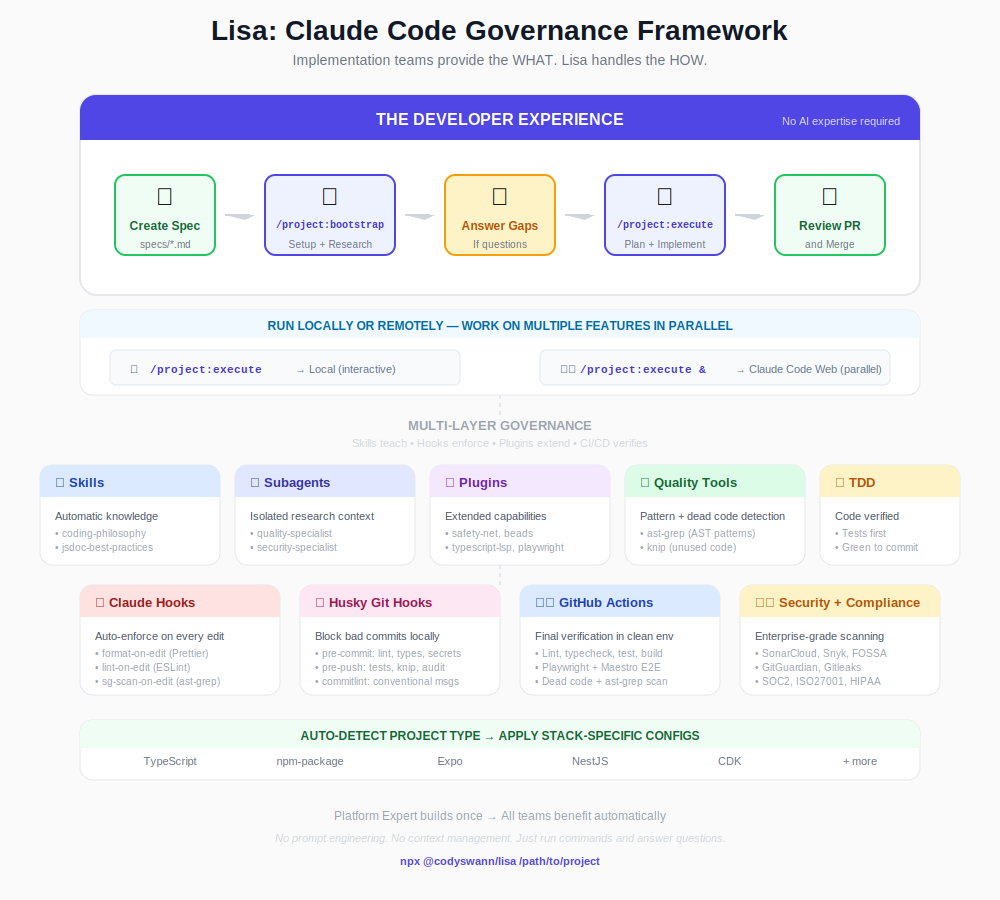

# Lisa: Claude Code Governance Framework



## Executive Summary

**Lisa** is a governance framework that ensures Claude Code produces high-quality, consistent code through multiple layers of guardrails, guidance, and automated enforcement. The system is designed with a key principle: **implementation teams don't need to be AI experts**—they just run commands and let Lisa handle the rest.

### Two Roles, One System

| Role | Responsibility | Skills Needed |
|------|----------------|---------------|
| **Platform Expert** | Sets up skills, hooks, ESLint rules, commands | High - deep AI/LLM expertise |
| **Implementation Teams** | Run commands, answer gap questions, review PRs | None - just use the tools |

The platform expert creates a "paved road" where implementation teams can leverage AI without understanding prompt engineering, context management, or AI limitations. Teams interact with simple slash commands, not raw AI prompts.

---

## Part 1: What is Lisa?

**Lisa** is a multi-layer quality system that prevents AI from producing inconsistent or low-quality code. It works by:

1. **Teaching Claude** the right patterns (Skills & Rules)
2. **Enforcing quality automatically** (Hooks, ESLint, Git Hooks)
3. **Guiding workflows** with pre-built commands (Slash Commands)
4. **Blocking bad code** before it's committed (Guardrails)

### The Problem Lisa Solves

Without Lisa, Claude Code can:
- Write inconsistent code styles across sessions
- Skip tests or quality checks when not explicitly told
- Over-engineer solutions or create unnecessary abstractions
- Mutate data instead of using immutable patterns
- Leave deprecated code instead of cleanly deleting it

### The Solution: Layered Governance

| Layer | What It Does | Example |
|-------|--------------|---------|
| **CLAUDE.md** | Direct behavioral rules | "Always use immutable patterns" |
| **Rules** | Auto-loaded project conventions | Coding philosophy, verification requirements |
| **Skills** | Teach patterns & philosophy | JSDoc best practices, skill creation |
| **Hooks** | Auto-enforcement on every edit | Format, lint, ast-grep scan after writes |
| **Plugins** | Extended capabilities | Safety Net, TypeScript LSP, Code Review |
| **ESLint Plugins** | Enforce code structure | Require statement ordering, prevent inline styles |
| **ast-grep** | Pattern-based linting | Custom AST rules for anti-patterns |
| **Knip** | Dead code detection | Find unused exports, dependencies, files |
| **Git Hooks** | Pre-commit quality gates | Block commits with type errors or secrets |
| **CI/CD** | Final verification | All checks + enterprise security tools |

---

## Part 2: How Teams Use Lisa

### Installation

```bash
# Install globally
npm install -g @codyswann/lisa

# Or use with npx (no install)
npx @codyswann/lisa /path/to/project
```

### The Workflow

Once Lisa is installed in a project, developers have three paths:

#### Path 1: Direct Implementation (Simple Tasks)

For straightforward, well-defined tasks:

```bash
# Just describe what you want
> I need to add a logout button to the Settings page
```

Claude implements it immediately, following all Lisa guardrails.

#### Path 2: Plan Mode (Medium to Complex Tasks)

For tasks that need research, planning, and structured implementation:

```bash
# Enter plan mode and describe your requirements
> /plan I need to add user authentication with OAuth

# Claude researches, creates a plan with tasks
# You review and approve the plan
# Claude implements, tests, and verifies
```

### The Plan Mode Workflow

When you use Claude's native plan mode:

```
1. Research
   • Claude explores the codebase
   • Finds relevant patterns and architecture
   • Looks up external documentation

2. Plan
   • Break work into small, independent tasks
   • Create plan file in plans/ directory
   • Create tasks with TaskCreate
   • Each task has verification command

3. Implement (TDD Loop)
   • Write failing tests first
   • Write implementation
   • Run tests until passing
   • Create atomic commits

4. Review
   • Run local code review and CodeRabbit review
   • Implement fixes from review feedback

5. Verify
   • Run verification commands for each task
   • Confirm all requirements met

6. Archive
   • Move completed plan to plans/completed/
   • Final commit and PR
```

---

## Part 3: The Building Blocks

### 1. Rules (Auto-Loaded Conventions)

**What they are:** Markdown files in `.claude/rules/` that are automatically loaded at the start of every Claude Code session.

**How it works:** Rules provide project-wide conventions, coding philosophy, and verification requirements that Claude follows without explicit invocation.

**Current rules:**

| Rule | Purpose |
|------|---------|
| `coding-philosophy.md` | Immutable patterns, function structure, TDD, YAGNI/SOLID/DRY/KISS |
| `PROJECT_RULES.md` | Project-specific conventions (package.lisa.json management, JSON handling) |
| `verfication.md` | Empirical verification requirements (proof commands for every task) |

**Directory structure:**
```
.claude/rules/
├── coding-philosophy.md
├── PROJECT_RULES.md
└── verfication.md
```

**Key distinction:** Rules are auto-loaded at session start and always active. Skills are invoked when relevant to the current task.

### 2. Skills (Specialized Knowledge)

**What they are:** Markdown files that teach Claude your team's patterns and philosophy, or contain workflow logic delegated from slash commands.

**How it works:** Skills operate in two tiers:

- **Foundational skills** (auto-applied) — Teach patterns and are automatically applied when relevant to the current task
- **Workflow skills** (invoked by commands) — Contain the implementation logic for slash commands; each command delegates to a corresponding skill

**Foundational skills:**

| Skill | Purpose |
|-------|---------|
| `jsdoc-best-practices` | Documentation standards ("why" over "what"), JSDoc ESLint rules |
| `skill-creator` | Guide for creating effective new skills |

**Workflow skills (31 total, organized by category):**

| Category | Skills |
|----------|--------|
| **Plan** | `plan-add-test-coverage`, `plan-fix-linter-error`, `plan-local-code-review`, `plan-lower-code-complexity`, `plan-reduce-max-lines`, `plan-reduce-max-lines-per-function` |
| **Project** (deprecated) | `project-bootstrap`, `project-setup`, `project-research`, `project-plan`, `project-execute`, `project-implement`, `project-review`, `project-document`, `project-verify`, `project-debrief`, `project-archive`, `project-local-code-review`, `project-lower-code-complexity`, `project-fix-linter-error`, `project-add-test-coverage`, `project-reduce-max-lines`, `project-reduce-max-lines-per-function` |
| **Git** | `git-commit`, `git-submit-pr`, `git-prune` |
| **Pull Request** | `pull-request-review` |
| **Jira** | `jira-create`, `jira-verify`, `jira-sync`, `jira-evidence`, `jira-add-journey`, `jira-journey` |
| **Triage** | `bug-triage`, `task-triage`, `epic-triage` |
| **Implementation** | `tdd-implementation`, `verification-lifecycle` |
| **Agent-specific** | `reproduce-bug`, `root-cause-analysis`, `codebase-research`, `task-decomposition` |
| **Review** | `quality-review`, `security-review`, `performance-review`, `test-strategy`, `acceptance-criteria` |
| **Lisa** | `lisa-learn`, `lisa-integration-test`, `lisa-review-implementation`, `lisa-review-project` |

**Directory structure:**
```
.claude/skills/
├── jsdoc-best-practices/       # Foundational (auto-applied)
│   ├── SKILL.md
│   └── references/
├── skill-creator/              # Foundational (auto-applied)
│   ├── SKILL.md
│   └── references/
├── plan-add-test-coverage/     # Workflow (invoked by /plan:add-test-coverage)
│   └── SKILL.md
├── plan-local-code-review/     # Workflow (invoked by /plan:local-code-review)
│   └── SKILL.md
├── project-execute/            # Deprecated (use plan mode instead)
│   └── SKILL.md
├── git-commit/                 # Workflow (invoked by /git:commit)
│   └── SKILL.md
└── ...                         # More workflow skills
```

### 3. Subagents (Specialized Workers)

**What they are:** Pre-configured AI personas that handle specific research and implementation tasks.

**Why they exist:** Research subagents work in isolated context windows, preventing pollution of the main conversation and allowing parallel research.

**Available subagents:**

| Subagent | Purpose |
|----------|---------|
| `architecture-specialist` | Implementation design, dependency mapping, pattern evaluation |
| `bug-fixer` | Fix bugs via TDD (reproduction becomes failing test) |
| `builder` | Build features via TDD (acceptance criteria become tests) |
| `debug-specialist` | Root cause analysis, log investigation, proof of bug causation |
| `git-history-analyzer` | Understand WHY code evolved |
| `jira-agent` | JIRA lifecycle: read ticket, determine intent, delegate to flow |
| `learner` | Post-implementation learning and skill creation |
| `performance-specialist` | N+1 queries, algorithmic complexity, memory leaks |
| `product-specialist` | User flows, acceptance criteria, UX validation |
| `quality-specialist` | Code correctness, coding philosophy, test coverage review |
| `security-specialist` | Threat modeling (STRIDE), OWASP Top 10, auth/secrets review |
| `skill-evaluator` | Evaluate whether learnings warrant new skills |
| `test-specialist` | Test strategy, test writing, coverage analysis |
| `verification-specialist` | Empirical proof via verification lifecycle |

### 4. Slash Commands (Explicit Actions)

**What they are:** Pre-built workflows you invoke with `/command-name`. Each command delegates to a corresponding skill in `.claude/skills/`. Commands serve as thin entry points; the workflow logic lives in the skill's `SKILL.md` file.

**Available commands:**

| Category | Command | Purpose |
|----------|---------|---------|
| **Plan** | `/plan:add-test-coverage` | Increase test coverage to threshold |
| | `/plan:fix-linter-error` | Fix all violations of ESLint rules |
| | `/plan:local-code-review` | Review local changes |
| | `/plan:lower-code-complexity` | Reduce complexity by 2 per run |
| | `/plan:reduce-max-lines` | Reduce max file lines threshold |
| | `/plan:reduce-max-lines-per-function` | Reduce max function lines threshold |
| **Project** (deprecated) | All `/project:*` commands | Deprecated — use plan mode or `/plan:*` commands instead |
| **Flows** | `/research` | Research a problem space, produce a PRD (Research flow) |
| | `/plan` | Break down a PRD into work items (Plan flow) |
| | `/fix` | Fix a bug (Implement/Fix) |
| | `/build` | Build a feature (Implement/Build) |
| | `/improve` | Improve existing code (Implement/Improve) |
| | `/investigate` | Investigate an issue (Implement/Investigate Only) |
| | `/verify` | Ship, deploy, and verify in production (Verify flow) |
| | `/ship` | Alias for `/verify` |
| | `/review` | Review code changes (sub-flow, also standalone) |
| | `/monitor` | Monitor application health (sub-flow, also standalone) |
| **Git** | `/git:commit` | Create conventional commits |
| | `/git:submit-pr` | Create/update pull request |
| | `/git:prune` | Clean up merged branches |
| **Pull Request** | `/pull-request:review` | Check and implement PR comments |
| **Code Review** | `/code-review:code-review` | Code review a pull request |
| **Jira** | `/jira:create` | Create Jira tickets from code |
| | `/jira:verify` | Verify ticket meets standards |
| **Safety Net** | `/safety-net:set-custom-rules` | Set custom Safety Net rules |
| | `/safety-net:set-statusline` | Set Safety Net status line |
| | `/safety-net:verify-custom-rules` | Verify custom Safety Net rules |
| **Lisa** | `/lisa:learn` | Analyze post-apply diff and identify upstream candidates |
| | `/lisa:review-implementation` | Compare against Lisa templates |
| | `/lisa:review-project` | Compare templates against target project |
| | `/lisa:integration-test` | Apply Lisa, verify project builds, fix upstream issues |

---

## Part 4: Guardrails (The Safety Net)

Lisa's governance operates through two distinct layers that serve fundamentally different purposes.

### The Context Layer (Non-Deterministic)

The context layer tells the agent *what to build* and *how to build it*. It encodes the organization's standards, the team's conventions, and the project's architectural decisions. This layer is inherently non-deterministic — the agent interprets these instructions, and two runs with identical context may produce different implementations that both satisfy the requirements.

| Context Source | What It Provides | Who Builds It |
|----------------|-----------------|---------------|
| **CLAUDE.md** | Direct behavioral rules and constraints | Platform Expert |
| **`.claude/rules/`** | Coding philosophy, patterns, conventions | Platform Expert |
| **Skills** | Reusable domain knowledge and workflows | Platform Expert |
| **Slash commands** | Pre-built workflows and task orchestration | Platform Expert |
| **`package.lisa.json`** | Governance templates (force/defaults/merge) | Platform Expert |
| **JSDoc preambles** | Existing code intent and architectural context | Both |
| **Project specification** | Functional requirements — what the artifact must do | Implementation Team |

Without context, the agent produces technically valid but contextually wrong artifacts — code that compiles but doesn't belong in this codebase.

### The Enforcement Layer (Deterministic)

The enforcement layer *proves* the agent adhered to the context. It is binary — pass or fail — with no room for interpretation. Every check is automated, reproducible, and tamper-proof.

| Enforcement Tool | What It Proves | Who Builds It |
|-----------------|---------------|---------------|
| **ESLint, Prettier, ast-grep** | Code structure matches mandated patterns | Platform Expert |
| **Jest, Playwright, Maestro** | Behavior matches specification | Both |
| **Snyk, SonarCloud, Gitleaks** | No known security vulnerabilities or leaked secrets | Platform Expert |
| **Claude Code local review, CodeRabbit** | Semantic correctness, convention adherence, logical bugs | Platform Expert |
| **k6, Lighthouse** | Performance and scalability meet SLOs | Platform Expert |
| **commitlint, Husky** | Process traceability and commit hygiene | Platform Expert |
| **GitHub Actions, branch protection** | All checks pass in a controlled environment | Platform Expert |
| **Claude Code hooks** | Real-time validation during generation | Platform Expert |
| **Safety Net** | Agents cannot bypass enforcement mechanisms | Platform Expert |

Without enforcement, the organization relies on the agent's interpretation of context — which is "vibe coding." Context without enforcement is aspirational. Enforcement without context is technically valid but wrong. Both layers are required.

The platform expert builds both layers. The implementation team operates within them without needing to understand how they work. This is the foundation of the "no AI expertise required" principle.

### Three Enforcement Checkpoints

Lisa enforces quality through **three checkpoints** — during generation, before commit, and in CI/CD:

### Layer 1: Claude Code Hooks (During Writing)

When Claude writes code, hooks automatically enforce quality:

| Hook | Trigger | Action |
|------|---------|--------|
| `format-on-edit.sh` | After Write/Edit | Run Prettier on changed files |
| `lint-on-edit.sh` | After Write/Edit | Run ESLint on changed files (exists but not currently in PostToolUse config) |
| `sg-scan-on-edit.sh` | After Write/Edit | Run ast-grep pattern scan |
| `install-pkgs.sh` | Session start | Ensure dependencies installed |
| `notify-ntfy.sh` | Notification events | Send push notifications |
| `sync-tasks.sh` | Task synchronization | Sync tasks between sessions and project directories |
| `check-tired-boss.sh` | User prompt submit | Enforce "I'm tired boss" greeting |
| `debug-hook.sh` | All events | Debug logging (when CLAUDE_DEBUG=1) |

**Current settings.json hook configuration (13 event types):**

```json
{
  "hooks": {
    "SessionStart": [
      { "matcher": "startup", "hooks": [{ "type": "command", "command": ".claude/hooks/install-pkgs.sh" }] },
      { "matcher": "", "hooks": [{ "type": "command", "command": ".claude/hooks/debug-hook.sh" }] }
    ],
    "PostToolUse": [
      { "matcher": "Write|Edit", "hooks": [
        { "type": "command", "command": ".claude/hooks/format-on-edit.sh" },
        { "type": "command", "command": ".claude/hooks/sg-scan-on-edit.sh" }
      ]},
      { "matcher": "", "hooks": [{ "type": "command", "command": ".claude/hooks/debug-hook.sh" }] }
    ],
    "Notification": [{ "matcher": "", "hooks": [{ "type": "command", "command": ".claude/hooks/debug-hook.sh" }] }],
    "Stop": [{ "matcher": "", "hooks": [{ "type": "command", "command": ".claude/hooks/debug-hook.sh" }] }],
    "SessionEnd": [{ "matcher": "", "hooks": [{ "type": "command", "command": ".claude/hooks/debug-hook.sh" }] }],
    "Setup": [{ "matcher": "", "hooks": [{ "type": "command", "command": ".claude/hooks/debug-hook.sh" }] }],
    "PreToolUse": [{ "matcher": "", "hooks": [{ "type": "command", "command": ".claude/hooks/debug-hook.sh" }] }],
    "PostToolUseFailure": [{ "matcher": "", "hooks": [{ "type": "command", "command": ".claude/hooks/debug-hook.sh" }] }],
    "PermissionRequest": [{ "matcher": "", "hooks": [{ "type": "command", "command": ".claude/hooks/debug-hook.sh" }] }],
    "SubagentStart": [{ "matcher": "", "hooks": [{ "type": "command", "command": ".claude/hooks/debug-hook.sh" }] }],
    "SubagentStop": [{ "matcher": "", "hooks": [{ "type": "command", "command": ".claude/hooks/debug-hook.sh" }] }],
    "UserPromptSubmit": [{ "matcher": "", "hooks": [{ "type": "command", "command": ".claude/hooks/debug-hook.sh" }] }],
    "PreCompact": [{ "matcher": "", "hooks": [{ "type": "command", "command": ".claude/hooks/debug-hook.sh" }] }]
  }
}
```

#### Agentic Code Review (During Writing / Before PR)

In addition to hooks that enforce syntactic rules, Lisa runs **agentic code review** — AI-powered reviewers that analyze code changes for semantic correctness, convention adherence, and logical bugs that static analysis cannot detect.

| Reviewer | When It Runs | What It Catches |
|----------|-------------|-----------------|
| **Claude Code local review** | Before PR submission (`/plan:local-code-review`) | Convention violations, logical bugs, CLAUDE.md adherence, missing edge cases |
| **CodeRabbit** | During CI/CD on pull request (`/coderabbit:review`) | Architectural drift, hardcoded values, fragile patterns, missing validation |

**How it works:**
- **Local review:** Multiple independent Claude agents analyze the changeset in parallel — each focused on a specific concern (convention compliance, bug detection, historical context). Findings above a confidence threshold are fed back to the generating agent for immediate correction.
- **CI/CD review:** CodeRabbit analyzes the pull request in a clean environment, providing an independent second perspective. Findings are addressed before the artifact can merge.

This dual-layer agentic review augments — but does not replace — human review. It reduces the burden on human reviewers by surfacing semantic issues before the PR reaches them.

### Layer 2: Git Hooks (Before Commit)

Before code is committed, Husky runs:

```
1. Branch Protection
   ❌ Blocks direct commits to: main, dev, staging

2. Secret Scanning (Gitleaks)
   ❌ Blocks commits containing API keys, passwords, tokens

3. Type Checking
   ❌ Blocks commits with TypeScript errors

4. Linting (ESLint + Prettier)
   ❌ Blocks commits with unfixable lint errors

5. Commit Message Validation
   ❌ Requires conventional commit format
   ❌ Requires "Co-Authored-By: Claude" attribution
```

### Layer 3: GitHub Actions CI/CD (Final Verification)

Even after local hooks pass, GitHub Actions runs **everything again** in a clean environment:

| Category | Jobs |
|----------|------|
| **Quality** | Lint, TypeCheck, Format, Build |
| **Testing** | Unit Tests, Integration Tests, E2E Tests, Playwright, Maestro |
| **Code Health** | Dead Code (Knip), AST Grep Scan |
| **Security** | npm audit, SonarCloud, Snyk, GitGuardian, FOSSA |
| **Compliance** | SOC 2, ISO 27001, HIPAA, PCI-DSS validation (optional) |

```
Quality Jobs (parallel):
├── 🧹 Lint
├── 🔍 Type Check
├── 📐 Format Check
├── 🏗️ Build
├── 🗑️ Dead Code (Knip)
└── 🔎 AST Grep Scan

Test Jobs (parallel):
├── 🧪 Unit Tests
├── 🧪 Integration Tests
├── 🧪 E2E Tests
├── 🎭 Playwright E2E
└── 📱 Maestro Mobile E2E

Security Jobs (parallel):
├── 🔒 npm Security Audit
├── 🔍 SonarCloud SAST
├── 🛡️ Snyk Dependency Scan
├── 🔐 GitGuardian Secret Detection
└── 📜 FOSSA License Compliance

Agentic Code Review:
├── 🤖 CodeRabbit PR Review
└── 🔎 Claude Code Local Review (pre-PR)

❌ Any failure blocks PR merge
✅ All pass → Ready for review
```

### Why Three Checkpoints?

Each checkpoint serves a distinct purpose in the enforcement layer:

| Checkpoint | Purpose | Failure Mode It Prevents |
|------------|---------|--------------------------|
| **Claude Code Hooks** | Real-time feedback during generation | Agent completes an entire artifact before discovering it violates a rule |
| **Agentic Code Review** | Semantic analysis at local and CI/CD levels | Logical bugs, convention drift, and architectural issues that static analysis cannot detect |
| **Git Hooks** | Local gate before code leaves the workstation | Broken code reaches the remote repository |
| **CI/CD** | Authoritative gate in a clean, reproducible environment | Locally-passing code exploits environment-specific conditions (cached deps, stale data, permissive configs) |

Without local enforcement (hooks), agents waste cycles pushing artifacts that will be rejected by the pipeline. Without CI/CD enforcement, locally-passing artifacts may mask real failures. Both local and pipeline enforcement must run the same tools with the same configurations to ensure parity.

---

## Part 5: Package.lisa.json (Template Governance)

### What It Is

Lisa uses a two-file governance model to manage `package.json` in target projects:

- **`package.lisa.json`** (source template) — Defines governance rules with `force`, `defaults`, and `merge` sections
- **`package.json`** (destination) — Remains clean with no governance markers

### Three Semantic Behaviors

| Behavior | What It Does | Use Case |
|----------|--------------|----------|
| **`force`** | Lisa's values completely replace project's values | Governance-critical configs (lint rules, mandatory dependencies, commit hooks) |
| **`defaults`** | Project's values preserved; Lisa provides fallback | Helpful templates projects can override (Node.js version, TypeScript version) |
| **`merge`** | Arrays are concatenated and deduplicated | Shared lists where both Lisa and project contribute (trusted dependencies) |

### Template Subdirectory Structure

Each project type directory contains these subdirectories:

| Subdirectory | Behavior |
|-------------|----------|
| `copy-overwrite/` | Files are overwritten on every Lisa run |
| `create-only/` | Files are created only if they don't exist (safe to customize) |
| `copy-contents/` | File contents are merged rather than replaced |
| `package-lisa/` | Contains `package.lisa.json` for package.json governance |

### Inheritance Chain

```
all/                    ← Applied to every project
└── typescript/         ← All TypeScript projects
    ├── expo/           ← Expo apps (inherits typescript)
    ├── nestjs/         ← NestJS apps (inherits typescript)
    ├── cdk/            ← CDK projects (inherits typescript)
    └── npm-package/    ← Published packages (inherits typescript)
```

An Expo project receives configurations from: `all/` → `typescript/` → `expo/`

---

## Part 5b: Configuration Governance (TSConfig & Jest)

Lisa governs TSConfig and Jest configurations using the same inheritance pattern as ESLint: Lisa owns entry points (copy-overwrite), stack-specific configs extend a shared base, and projects customize via create-only local files and threshold overrides.

### TSConfig Inheritance Chain

```
tsconfig.json             (copy-overwrite, per-stack entry point)
├── tsconfig.{stack}.json (copy-overwrite, stack config)
│   └── tsconfig.base.json    (copy-overwrite, governance settings)
└── tsconfig.local.json        (create-only, project paths/includes/excludes)
```

Uses TS 5.0+ array `extends`: `"extends": ["./tsconfig.{stack}.json", "./tsconfig.local.json"]`

**What goes where:**

| Setting | Base (governance) | Stack | Local (project) |
|---------|:-:|:-:|:-:|
| `strict: true` | Y | | |
| `skipLibCheck`, `forceConsistentCasingInFileNames` | Y | | |
| `esModuleInterop`, `resolveJsonModule` | Y | | |
| `target`, `module`, `moduleResolution` | | Y | |
| `jsx` (expo), `emitDecoratorMetadata` (nestjs) | | Y | |
| `paths`, `include`/`exclude`, `outDir`/`rootDir` | | | Y |

### Jest Inheritance Chain

```
jest.config.ts            (copy-overwrite, per-stack entry point)
├── jest.{stack}.ts       (copy-overwrite, stack config)
│   └── jest.base.ts          (copy-overwrite, shared utilities)
├── jest.config.local.ts      (create-only, project customizations)
└── jest.thresholds.json      (create-only, coverage thresholds)
```

**`jest.base.ts` exports:**
- `defaultThresholds` — default 70/70/70/70 coverage thresholds
- `defaultCoverageExclusions` — patterns excluded from coverage (`.d.ts`, tests, mocks, etc.)
- `mergeThresholds(defaults, overrides)` — merge coverage thresholds from `jest.thresholds.json`
- `mergeConfigs(...configs)` — merge Jest configs (arrays concatenate/deduplicate, objects shallow-merge)

**What goes where:**

| Setting | Base | Stack | Local (project) |
|---------|:-:|:-:|:-:|
| `testTimeout` | Y | | |
| `coverageThreshold` | Y (default) | | via `jest.thresholds.json` |
| `testEnvironment` | | Y | |
| `transform` | | Y | |
| `testMatch`/`testRegex` | | Y | Y (override) |
| `moduleNameMapper`, `setupFiles` | | | Y |
| `collectCoverageFrom` | | Y (default) | Y (override) |

### Stack-Specific Configurations

| Stack | TSConfig | Jest |
|-------|----------|------|
| **TypeScript** | ES2022, NodeNext, strict unused checks | ts-jest ESM preset, `tests/` + `src/` test directories |
| **Expo** | react-native JSX, platform module suffixes | Manual React Native resolution (jsdom-compatible), scoped Expo directory coverage |
| **NestJS** | CommonJS, ES2021, decorators enabled | ts-jest, `spec.ts` convention, extensive boilerplate exclusions |
| **CDK** | CommonJS, ES2020, relaxed unused checks | ts-jest, `test/` directory, `lib/` + `util/` coverage only |

### Migration Notes

When Lisa runs on existing projects:
- **copy-overwrite files** (`tsconfig.json`, `jest.config.ts`) overwrite existing project files
- **create-only files** (`tsconfig.local.json`, `jest.config.local.ts`, `jest.thresholds.json`) only created if absent
- Projects move project-specific tsconfig settings (paths, includes, outDir) into `tsconfig.local.json`
- Projects move project-specific jest settings (moduleNameMapper, setupFiles) into `jest.config.local.ts`
- Projects move coverage thresholds into `jest.thresholds.json`

---

## Part 6: Advanced Quality Tools

### ast-grep (Pattern-Based Linting)

**What it is:** A structural code search tool that finds patterns based on AST (Abstract Syntax Tree) rather than text.

**Why it matters:** ESLint catches syntax issues, but ast-grep catches semantic anti-patterns that ESLint can't detect.

**Example use cases:**
- Detect deprecated API usage patterns
- Find components missing required props
- Catch unsafe type assertions
- Enforce architectural boundaries

**How it works:**

```yaml
# ast-grep/rules/no-unsafe-any.yml
id: no-unsafe-any
language: typescript
rule:
  pattern: $X as any
message: "Avoid 'as any' type assertions - use proper typing"
severity: error
```

**Integration points:**
- **Claude Hook:** `sg-scan-on-edit.sh` runs after every file edit
- **lint-staged:** Scans staged files before commit
- **CI/CD:** `sg_scan` job in quality workflow

### Knip (Dead Code Detection)

**What it is:** A tool that finds unused files, dependencies, and exports in your project.

**Why it matters:** Dead code accumulates silently. Knip catches it before it becomes technical debt.

**What it detects:**
- Unused files and directories
- Unused dependencies in `package.json`
- Unused exports from modules
- Unused types and interfaces

**Configuration:**

```json
{
  "$schema": "https://unpkg.com/knip@5/schema.json",
  "entry": ["src/**/*.ts"],
  "ignore": ["**/*.test.ts", "**/dist/**"],
  "ignoreDependencies": ["eslint-*", "lint-staged"]
}
```

**Integration points:**
- **pre-push hook:** Runs before pushing to remote
- **CI/CD:** `dead_code` job in quality workflow

### Safety Net Plugin

**What it is:** A Claude Code plugin that blocks dangerous git commands.

**Why it matters:** Prevents accidental destructive operations like `--no-verify`, force pushes, or bypassing hooks.

**Blocked commands:**
```json
{
  "rules": [
    {
      "name": "block-git-commit-no-verify",
      "command": "git",
      "subcommand": "commit",
      "block_args": ["--no-verify", "-n"],
      "reason": "--no-verify is not allowed. Fix the commit to pass all checks."
    },
    {
      "name": "block-git-push-no-verify",
      "command": "git",
      "subcommand": "push",
      "block_args": ["--no-verify"],
      "reason": "--no-verify is not allowed. Fix the push to pass all checks."
    }
  ]
}
```

**Slash commands for Safety Net configuration:**
- `/safety-net:set-custom-rules` — Define custom blocking rules
- `/safety-net:set-statusline` — Configure status line display
- `/safety-net:verify-custom-rules` — Validate rule configuration

### .lisaignore (Selective File Management)

**What it is:** A file that allows granular control over which files Lisa processes.

**Why it matters:** Projects may need to opt out of Lisa management for specific files without disabling Lisa entirely.

**Syntax:** Supports gitignore-style patterns:

```
# Lines starting with # are comments
# Exact file names:
eslint.config.mjs
# Directory patterns:
.claude/hooks/
# Glob patterns:
*.example.json
**/*.custom.ts
```

### Lisa Version Checking

Lisa validates it's running the latest version during execution. A `.lisa-manifest` file tracks which version of Lisa generated the current configuration, ensuring projects stay up to date with governance changes.

### Claude Code Plugins

Lisa enables several official and marketplace plugins:

| Plugin | Purpose |
|--------|---------|
| **safety-net** | Block dangerous git commands |
| **typescript-lsp** | TypeScript language server integration |
| **code-simplifier** | Automated code refactoring and simplification |
| **code-review** | AI-powered code review |
| **playwright** | Browser automation for E2E testing |

### Push Notifications (ntfy.sh)

**What it is:** Integration with [ntfy.sh](https://ntfy.sh) for push notifications.

**Why it matters:** Enables async workflows with Claude Code Web—fire off tasks and get notified when they complete or need attention.

**Notification triggers:**
- Permission prompts (when Claude needs approval)
- Idle prompts (when Claude is waiting for input)
- Stop events (when Claude finishes or encounters errors)

**Setup:**
1. Create a topic at ntfy.sh
2. Set `NTFY_TOPIC` environment variable
3. Install the ntfy app on your phone

---

## Part 7: Enterprise Security Tools

Lisa's CI/CD workflow includes enterprise-grade security scanning:

### Security Scanning Tools

| Tool | What It Does | When It Runs |
|------|--------------|--------------|
| **SonarCloud** | Static Application Security Testing (SAST) | PR checks |
| **Snyk** | Dependency vulnerability scanning | PR checks |
| **GitGuardian** | Secret detection in code history | PR checks |
| **FOSSA** | License compliance checking | PR checks |
| **npm audit** | Package vulnerability audit | Pre-push + CI |
| **Gitleaks** | Secret scanning in staged files | Pre-commit |

### Compliance Frameworks

Lisa supports validation against major compliance frameworks:

| Framework | Controls Validated |
|-----------|-------------------|
| **SOC 2 Type II** | CC6.1 (Access Controls), CC7.1 (Operations), CC7.2 (Monitoring), CC8.1 (Change Management) |
| **ISO 27001** | A.8.1 (Asset Management), A.12.1 (Operational Security), A.14.2 (Security in Development) |
| **HIPAA** | 164.312 (Access, Audit, Integrity, Transmission Security) |
| **PCI-DSS v4.0** | Requirements 2, 6, 11 (Passwords, Secure Dev, Security Testing) |

**Enabling compliance validation:**

```yaml
quality:
  uses: ./.github/workflows/quality.yml
  with:
    compliance_framework: 'soc2'
    audit_retention_days: 90
    generate_evidence_package: true
```

### Audit Logging

Every CI/CD run generates an audit log with:
- Workflow execution details
- Job status for all quality checks
- Security scan results
- Compliance control validation
- Artifact retention for audit trails

---

## Part 8: Project Type Detection

Lisa automatically detects your project type and applies appropriate configurations:

| Type | Detection |
|------|-----------|
| **TypeScript** | `tsconfig.json` or `"typescript"` in package.json |
| **npm-package** | Publishable package with `main`/`bin`/`exports` |
| **Expo** | `app.json`, `eas.json`, or `"expo"` in package.json |
| **NestJS** | `nest-cli.json` or `"@nestjs"` in package.json |
| **CDK** | `cdk.json` or `"aws-cdk"` in package.json |

### Cascading Inheritance

Configs inherit from parent types:

```
all/                    ← Applied to every project
└── typescript/         ← All TypeScript projects
    ├── expo/           ← Expo apps (inherits typescript)
    ├── nestjs/         ← NestJS apps (inherits typescript)
    ├── cdk/            ← CDK projects (inherits typescript)
    └── npm-package/    ← Published packages (inherits typescript)
```

An Expo project receives configurations from: `all/` → `typescript/` → `expo/`

### Template Subdirectory Structure

Each project type directory can contain:

| Subdirectory | Behavior |
|-------------|----------|
| `copy-overwrite/` | Files overwritten on every Lisa run |
| `create-only/` | Files created only if absent |
| `copy-contents/` | File contents merged |
| `package-lisa/` | `package.lisa.json` for package.json governance |

---

## Part 9: Implementation for Your Team

### Phase 1: Foundation

Create your `.claude` directory structure:

```
.claude/
├── settings.json          # Global hooks and configuration
├── rules/                 # Auto-loaded conventions and philosophy
├── skills/                # Teach Claude your patterns
├── commands/              # Pre-built workflows
├── hooks/                 # Auto-enforcement scripts
└── agents/                # Custom subagents
```

### Phase 2: Write Rules and Skills

Start with these essentials:

**Rules** (auto-loaded every session):
1. **Coding philosophy** — Immutable patterns, function structure, TDD
2. **Project conventions** — Team-specific patterns and guidelines
3. **Verification requirements** — How to prove tasks are complete

**Skills** (two tiers):
1. **Foundational skills** (auto-applied) — Documentation standards, skill creation patterns. These teach Claude your team's conventions and are applied automatically when relevant.
2. **Workflow skills** (command-delegated) — Automatically created when you build slash commands that delegate to skills. Each `/command:name` maps to a skill in `.claude/skills/`.

### Phase 3: Add Commands

Create slash commands for your workflows:

1. `/plan` — Enter plan mode, describe requirements
2. `/plan:local-code-review` — Review local changes
3. `/git:commit` — Create conventional commits
4. `/<your-workflow>` — Custom commands for your team

### Phase 4: Integration

Connect to your tools:

| Tool | Integration | Purpose |
|------|-------------|---------|
| **Jira** | `/jira:create`, `/jira:verify` | Ticket management |
| **GitHub** | `/git:submit-pr`, `/pull-request:review` | PR operations |
| **Playwright** | Plugin + E2E workflow | Browser E2E testing |
| **Maestro** | CI/CD workflow | Mobile E2E testing |
| **CodeRabbit** | `/coderabbit:review` | AI code review |
| **SonarCloud** | CI/CD + `/sonarqube:*` | SAST analysis |
| **Snyk** | CI/CD workflow | Dependency scanning |
| **GitGuardian** | CI/CD workflow | Secret detection |
| **FOSSA** | CI/CD workflow | License compliance |
| **ntfy.sh** | Notification hooks | Push notifications |

---

## Part 10: Key Success Factors

### 1. Gap Detection is Critical

The workflow **stops if research finds open questions**. This prevents:
- Implementing based on assumptions
- Building the wrong thing
- Wasted effort on rework

### 2. Tasks Must Be Independent

Each task in the plan must be:
- Self-contained (no dependencies on other tasks)
- Small enough to complete in one session
- Clear about acceptance criteria

### 3. Rules and Skills Compound Over Time

Every project adds to `.claude/rules/PROJECT_RULES.md` through the debrief phase. The `skill-evaluator` agent determines whether learnings warrant new skills, new rules, or can be omitted. This creates an ever-growing knowledge base that improves future implementations.

### 4. TDD is Non-Negotiable

The workflow enforces:
1. Write failing tests first
2. Implement until tests pass
3. No commits with failing tests

This ensures AI-generated code is verified, not assumed correct.

### 5. Human Checkpoints

The workflow has built-in human touchpoints:
- **Before execute:** Human answers research gaps
- **After execute:** Human reviews before merge
- **After debrief:** Human can update .claude/rules/PROJECT_RULES.md

---

## Part 11: Expected Outcomes

### For Implementation Teams

- **No AI expertise required** — Just run commands and answer questions
- **No prompt engineering** — The system handles context and instructions
- **No context management** — Subagents isolate complexity
- Faster onboarding (skills document patterns)
- Consistent code quality (enforced standards)
- Reduced boilerplate (AI handles scaffolding)

**Mental model:**
```
I have a ticket → Enter /plan mode → Answer questions → Claude implements → Review and merge
```

### For Platform Experts

- Initial setup investment pays dividends across all projects
- Skills and commands can be shared across teams
- Guardrails ensure AI output meets standards without manual review
- Debrief phase captures learnings automatically
- **Continuous improvement** — Monitor, identify patterns, refine the system

### For Teams

- Institutional knowledge captured in rules and skills
- Reproducible workflows across projects
- Self-improving system (debrief → rules/skills)
- Clear project documentation
- **Democratized AI access** — Every developer benefits equally

---

## Part 12: Extending Lisa

Lisa currently supports TypeScript, npm-package, Expo, NestJS, and CDK. The architecture is designed for community extensions.

### To Contribute a New Stack

1. Create a new detector in `src/detection/detectors/`
2. Register the detector in `src/detection/index.ts`
3. Add the config directory structure:

```bash
mkdir -p your-stack/{copy-overwrite,create-only,copy-contents,package-lisa}
mkdir -p your-stack/copy-overwrite/.claude/skills/
```

### Stacks That Would Benefit from Lisa

- **Next.js** — App Router patterns, Server Components
- **React Native** — Native module patterns, platform-specific code
- **Django** — Model/View/Template separation
- **FastAPI** — Dependency injection, async patterns
- **Spring Boot** — Bean lifecycle, annotation patterns
- **Go** — Error handling, middleware patterns
- **Rust** — Ownership patterns, async runtime
- **Vue/Nuxt** — Composition API, store patterns
- **Terraform** — Module structure, state management
- **Kubernetes** — Helm charts, operator patterns

---

## Conclusion

### The Core Principle

**Implementation teams shouldn't need to be AI experts to benefit from AI.**

The platform expert's job is to create a system where teams can:
1. Get a spec or ticket
2. Run a few commands
3. Answer questions when asked
4. Review and merge

That's it. No prompt engineering. No context management. No understanding of AI limitations.

### What the Platform Expert Builds

The platform expert builds both the context layer and the enforcement layer:

**Context Layer** (tells the agent what/how):
1. **Rules** — Define conventions that Claude follows automatically every session
2. **Skills** — Document your team's knowledge so Claude applies it when relevant
3. **Commands** — Build the simple interface teams actually use
4. **Subagents** — Create specialized workers that isolate complexity

**Enforcement Layer** (proves the agent adhered):
5. **Hooks** — Real-time validation during generation (Claude Code hooks) and before commit (git hooks)
6. **ESLint + ast-grep** — Static analysis and pattern-based enforcement
7. **Agentic Code Review** — Semantic analysis via Claude Code local review (pre-PR) and CodeRabbit (CI/CD)
8. **CI/CD** — Authoritative pipeline with security, performance, and quality gates
9. **Safety Net** — Prevents agents from bypassing enforcement mechanisms
10. **Integration** — Connect enforcement to external tools (SonarCloud, Snyk, GitGuardian, FOSSA)
11. **Compliance** — Configure security tools and compliance frameworks

### The Trust Equation

```
AI Autonomy = f(Context × Enforcement × Human Checkpoints)
```

Context without enforcement is "vibe coding" — the agent interprets instructions with no proof it followed them. Enforcement without context produces technically valid but wrong artifacts. Both layers are required, and the platform expert builds both so implementation teams don't have to.

### Getting Started

Start small—one rule, one command, one hook—and expand as your team gains confidence. The key insight is that **AI autonomy requires automated enforcement**. The more guardrails you have (formatting, linting, testing, secret scanning), the more freedom you can safely give the AI.

---

## Quick Reference

### File Locations

| File/Directory | Purpose |
|----------------|---------|
| **CLAUDE.md** | Behavioral rules (Always/Never directives) |
| **.claude/rules/** | Auto-loaded conventions and philosophy |
| **.claude/rules/PROJECT_RULES.md** | Project-specific conventions |
| **.claude/settings.json** | Hooks, plugins, environment config |
| **.claude/skills/** | Team knowledge and patterns |
| **.claude/commands/** | Slash command definitions |
| **.claude/hooks/** | Enforcement shell scripts |
| **.claude/agents/** | Specialized subagent definitions |
| **.safety-net.json** | Safety Net plugin rules |
| **.lisaignore** | Files to exclude from Lisa management |
| **.lisa-manifest** | Lisa version and generation tracking |
| **package.lisa.json** | Package.json governance template |
| **sgconfig.yml** | ast-grep configuration |
| **ast-grep/rules/** | Custom ast-grep lint rules |
| **knip.json** | Dead code detection config |
| **eslint.config.ts** | ESLint configuration |
| **tsconfig.json** | TypeScript configuration (governed entry point) |
| **tsconfig.base.json** | TSConfig governance settings (copy-overwrite) |
| **tsconfig.{stack}.json** | Stack-specific TSConfig (copy-overwrite) |
| **tsconfig.local.json** | Project-specific TSConfig (create-only) |
| **jest.config.ts** | Jest configuration (governed entry point) |
| **jest.base.ts** | Jest shared utilities (copy-overwrite) |
| **jest.{stack}.ts** | Stack-specific Jest config (copy-overwrite) |
| **jest.config.local.ts** | Project-specific Jest settings (create-only) |
| **jest.thresholds.json** | Coverage threshold overrides (create-only) |
| **.prettierrc.json** | Prettier formatting config |

### Key Scripts

| Script | Purpose |
|--------|---------|
| `bun run lint` | Run ESLint |
| `bun run typecheck` | TypeScript type checking |
| `bun run test` | Run all tests (Jest) |
| `bun run test:unit` | Run unit tests |
| `bun run test:integration` | Run integration tests |
| `bun run knip` | Dead code detection |
| `bun run sg:scan` | ast-grep pattern scan |
| `bun run format` | Format with Prettier |

---

## Resources

- **README.md** — Full technical documentation
- **CLAUDE.md** — Behavioral rules for this project
- **.claude/rules/** — Auto-loaded conventions and philosophy
- **.claude/skills/** — Team knowledge and patterns
- **.claude/commands/** — Available slash commands
- **.claude/hooks/** — Automated enforcement scripts
- **.claude/agents/** — Specialized subagent definitions

---

## Getting Help

- Run `/help` for Claude Code help
- Check [GitHub Issues](https://github.com/CodySwannGT/lisa/issues) for known issues
- Read [Contributing Guide](CONTRIBUTING.md) to contribute improvements
